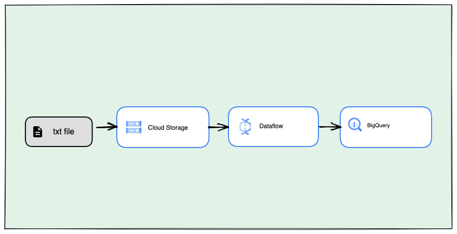

# Gcp-Dataflow

# Gcp-Dataflow

### 1. batch processing 

**README**

## Data Processing Using Beam ParDo

**Author:** Syed Sajjad Askari

**Educational Purpose Only**

This code performs the following steps:

1. Reads data from a CSV file.
2. Transforms the data using Beam ParDo (user-defined logic).
3. Writes the transformed data into a specified BigQuery table.


create using Google Diagram tool https://googlecloudcheatsheet.withgoogle.com/

## Prerequisites

* Python 3.8+
* Apache Beam
* Google Cloud Platform account

## Getting Started

1. Clone this repository:

```
git clone https://github.com/syedsajjadaskari/Gcp-Dataflow.git
```

2. Install the required dependencies:

```
pip install -r requirements.txt
```

3. Set up your Google Cloud Platform account.

4. Create a BigQuery table to store the transformed data.

5. Run the following command to start the pipeline:

```
python data_processing_pipeline.py
```


## License

This code is licensed under the MIT License.
